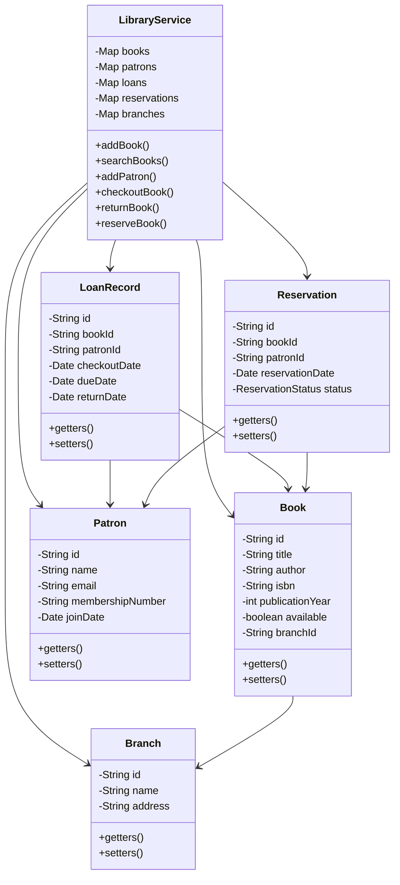

# Library Management System

A command-line interface (CLI) application for managing a library system, implemented in Java.

## Features

### Core Features
- Book Management
  - Add new books to the library inventory
  - Search books by title, author, or ISBN
  - Track book availability

- Patron Management
  - Add new patrons
  - Track patron information
  - Manage membership details

- Lending Process
  - Check out books to patrons
  - Process book returns
  - Track due dates

### Advanced Features
- Multi-branch Support
  - Support for multiple library branches
  - Track books by branch location

- Reservation System
  - Allow patrons to reserve unavailable books
  - Queue-based reservation fulfillment
  - Automatic status updates

## Design Patterns Used

1. **Singleton Pattern**
   - Used in the LibraryService class to ensure a single instance manages all library operations

2. **Observer Pattern**
   - Implemented in the reservation system to notify patrons when books become available

## SOLID Principles Implementation

1. **Single Responsibility Principle**
   - Each class has a single, well-defined purpose
   - Separate classes for Book, Patron, LoanRecord, etc.

2. **Open/Closed Principle**
   - New functionality can be added through extension rather than modification
   - Reservation system can be extended without modifying core lending functionality

3. **Liskov Substitution Principle**
   - All classes use proper inheritance hierarchies
   - Subtypes can be used in place of their base types

4. **Interface Segregation Principle**
   - Interfaces are kept focused and minimal
   - Clients aren't forced to depend on methods they don't use

5. **Dependency Inversion Principle**
   - High-level modules don't depend on low-level modules
   - Both depend on abstractions

## Class Diagram



## Getting Started

1. Compile the Java files:
```bash
javac src/*.java
```

2. Run the application:
```bash
java -cp src Main
```

## Usage

The application provides a menu-driven interface with the following options:

1. Add Book
2. Search Books
3. Add Patron
4. Checkout Book
5. Return Book
6. Reserve Book
0. Exit

Follow the prompts to perform various library management operations.
